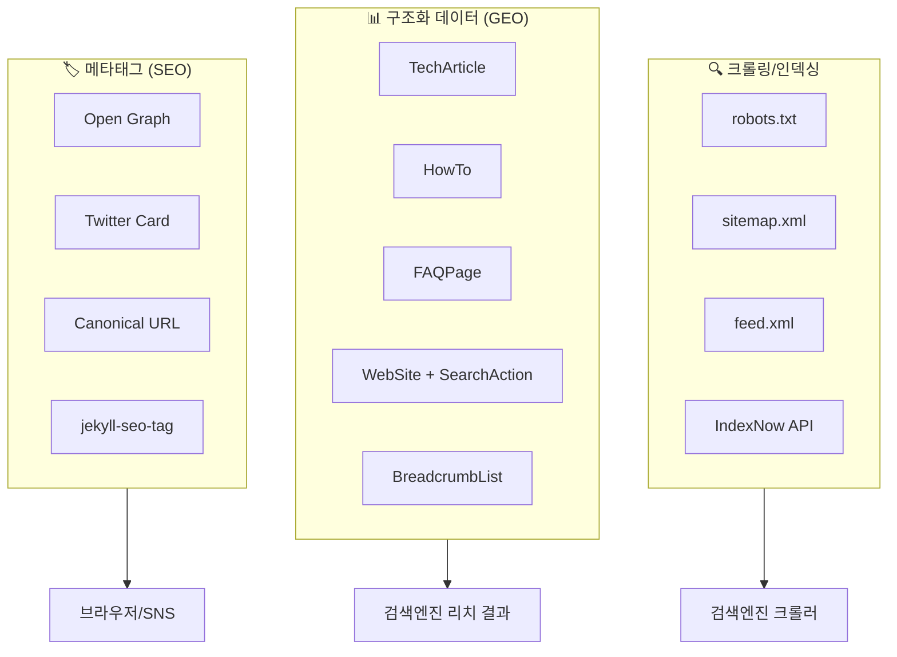
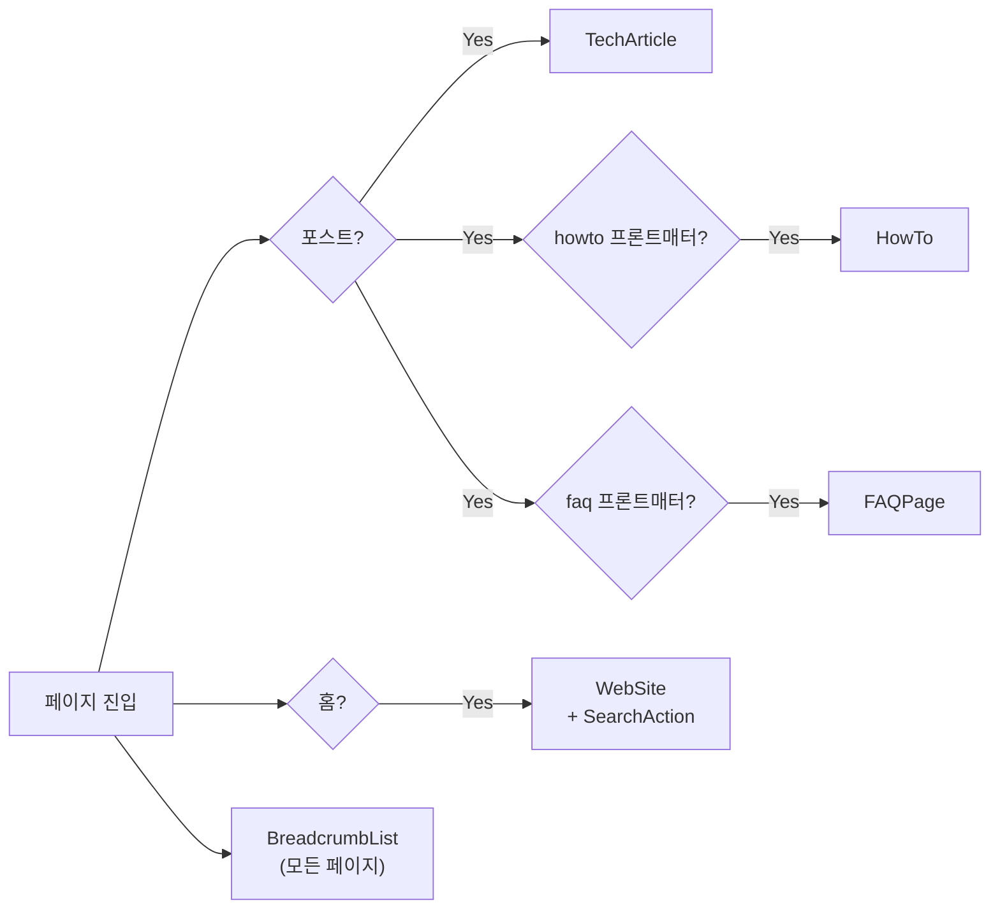
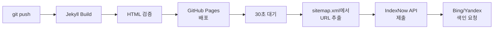

## TL;DR

- 예전 GitHub 블로그 도메인(`ooyuo.github.io`)을 삭제했다가 다시 만들려니 Google Search Console에서 꼬여버렸어요
- 어차피 신입 때 만든 계정명도 마음에 안 들어서 GitHub 아이디까지 바꿨습니다
- 이왕 새로 시작하는 거 SEO/GEO를 제대로 해보자 싶어서, JSON-LD 구조화 데이터부터 IndexNow 자동 제출까지 전면 개편했어요

---

## 문제 인식

몇 년 전에 `ooyuo.github.io`로 GitHub Pages 블로그를 운영하고 있었는데, 어느 순간 티스토리로 갈아탔거든요. 그러면서 GitHub 레포도 자연스럽게 삭제했고, 도메인은 한동안 그냥 방치해뒀습니다.

그러다 다시 GitHub Pages로 돌아오려고 했어요. 같은 레포명으로 블로그를 만들었는데, 여기서 문제가 터집니다. Google Search Console에 이전 도메인이 여전히 남아 있었거든요. 이미 삭제한 속성인데 새 속성으로 등록하려니 소유권 인증부터 꼬이기 시작했어요.

결국 GitHub 아이디 자체를 `ooyuo`에서 `z9-durun`으로 변경했습니다. 사실 이전 아이디가 신입 때 아무 생각 없이 만든 거라 오래전부터 바꾸고 싶기도 했고요. 도메인이 `z9-durun.github.io`로 바뀌면서 Search Console 문제는 해결됐어요.

근데 나중에 알게 된 게 있습니다. Google Search Console에 **'주소 변경'** 도구가 따로 있었어요. 기존 속성에서 새 속성으로의 이전을 Google에 직접 알려주는 기능인데, 이미 레포를 삭제하고 아이디까지 다 바꾼 뒤였습니다. 알았으면 좀 더 깔끔하게 처리했을 텐데요.

---

## 해결 방향 설계

도메인 변경을 하고 나니, 이왕 새로 시작하는 거 SEO를 제대로 해보고 싶더라고요. 이전 회사에서 GA4를 다뤘던 경험이 있어서 웹 분석 자체는 익숙했지만, 블로그에 구조화 데이터(GEO)까지 제대로 적용해 본 적은 없었거든요.

**"진짜 SEO/GEO를 제대로 하면 개인 블로그도 검색엔진에 잘 타는 걸까?"**

이게 이번 개편의 동기였습니다. 메타태그 몇 개 넣는 수준이 아니라, Schema.org 구조화 데이터를 제대로 설계해서 검색엔진이 내 콘텐츠를 정확하게 이해하도록 만들어보고 싶었어요.

목표로 잡은 건 이렇습니다:

1. **구조화 데이터 레이어** — TechArticle, HowTo, FAQPage 등 콘텐츠 특성에 맞는 Schema.org 타입 적용
2. **크롤링/인덱싱 최적화** — robots.txt, sitemap, IndexNow로 검색엔진이 빠르게 새 글을 발견하도록
3. **메타태그 정비** — Open Graph, Twitter Card 이미지 보정, 시맨틱 HTML 수정
4. **프론트매터 표준화** — 포스트별로 구조화 데이터가 자동 활성화되는 구조

전체 구조를 그려보면 이런 모양이에요:



---

## 구현

### 1. _config.yml — 기반 설정

도메인 변경과 함께 SEO 기반 설정을 정리했습니다.

```yaml
url: "https://z9-durun.github.io"

github:
  username: z9-durun

social:
  name: chole
  email: z9.durun@gmail.com
  links:
    - https://github.com/z9-durun

webmaster_verifications:
  google: YOUR_GOOGLE_VERIFICATION_CODE

analytics:
  google:
    id: "G-XXXXXXXXXX"

plugins:
  - jekyll-sitemap   # /sitemap.xml 자동 생성
  - jekyll-feed      # /feed.xml 자동 생성 (신규 추가)
```

`jekyll-sitemap`은 원래 있었고, `jekyll-feed`를 새로 추가했어요. RSS 피드가 검색엔진이 새 콘텐츠를 발견하는 또 다른 경로가 되거든요.

### 2. robots.txt — 크롤러 안내

기존에는 robots.txt가 아예 없었습니다. 새로 만들었어요.

```
User-agent: *
Allow: /

Sitemap: https://z9-durun.github.io/sitemap.xml
```

별거 없어 보이지만, 크롤러에게 sitemap 위치를 알려주는 역할을 합니다.

### 3. JSON-LD 구조화 데이터 — 가장 공들인 부분

이번 개편에서 제일 시간을 많이 쓴 부분이에요. `_includes/seo-jsonld.html`을 만들어서 5가지 Schema.org 타입을 조건부로 출력하도록 설계했습니다.

페이지 타입에 따라 어떤 스키마가 붙는지 정리하면 이래요:



**TechArticle (모든 포스트)**

기존에 흔히 쓰이는 `BlogPosting` 대신 `TechArticle` 타입을 선택했어요. 기술 블로그니까 더 정확한 시그널을 검색엔진에 보낼 수 있죠.

```html

<script type="application/ld+json">
{
  "@context": "https://schema.org",
  "@type": "TechArticle",
  "headline": "{{ page.title | escape }}",
  "description": "{{ page.description | default: page.excerpt | strip_html | truncate: 160 | escape }}",
  "inLanguage": "{{ site.lang | default: 'ko-KR' }}",
  "wordCount": {{ page.content | number_of_words }},
  "articleSection": "{{ page.categories | join: ', ' }}",
  "author": {
    "@type": "Person",
    "name": "{{ site.social.name }}",
    "jobTitle": "Frontend Developer",
    "knowsAbout": ["React", "React Native", "TypeScript", "Frontend Development"],
    "sameAs": [
      "{{ link }}",
    ]
  },
  "datePublished": "{{ page.date | date_to_xmlschema }}",
  "dateModified": "{{ page.last_modified_at | default: page.date | date_to_xmlschema }}",
  "keywords": "{{ page.tags | join: ', ' }}"
}
</script>

```

여기서 포인트는 `inLanguage`, `wordCount`, `articleSection`, 저자의 `jobTitle`과 `knowsAbout`까지 채운 거예요. 검색엔진이 콘텐츠의 언어, 분량, 분야, 저자 전문성을 한눈에 파악할 수 있습니다.

**HowTo (프론트매터로 제어)**

포스트 프론트매터에 `howto:` 키를 넣으면 HowTo 구조화 데이터가 알아서 생성돼요.

```yaml
howto:
  name: "Storybook 인터랙션 테스트를 함수형으로 설계하는 방법"
  time: "PT45M"
  steps:
    - name: "TestFlow 러너 만들기"
      text: "테스트 컨텍스트를 관리하고 스텝을 순차 실행하는 createTestFlow 함수를 작성합니다."
    - name: "공통 인터랙션 함수 추출"
      text: "자주 사용하는 인터랙션을 재사용 가능한 함수로 분리합니다."
```

```html

<script type="application/ld+json">
{
  "@context": "https://schema.org",
  "@type": "HowTo",
  "name": "{{ page.howto.name | default: page.title | escape }}",
  "totalTime": "{{ page.howto.time | default: 'PT30M' }}",
  "step": [
    
    {
      "@type": "HowToStep",
      "position": {{ forloop.index }},
      "name": "{{ step.name | escape }}",
      "text": "{{ step.text | escape }}"
    },
    
  ]
}
</script>

```

이 구조 덕분에 새 포스트를 쓸 때 프론트매터만 채우면 됩니다. 템플릿을 건드릴 필요가 없어요.

**FAQPage도 동일한 패턴**인데요, 프론트매터에 `faq:` 키를 넣으면 FAQ 리치 결과를 노릴 수 있습니다.

```yaml
faq:
  - question: "GitHub Pages 도메인 변경 시 Search Console은?"
    answer: "주소 변경 도구를 사용하면 됩니다..."
```

**WebSite + SearchAction (홈 페이지)**

홈 페이지에는 사이트 내 검색 기능을 구조화 데이터로 노출했어요.

```html

<script type="application/ld+json">
{
  "@context": "https://schema.org",
  "@type": "WebSite",
  "name": "{{ site.title }}",
  "url": "{{ site.url }}",
  "potentialAction": {
    "@type": "SearchAction",
    "target": {
      "@type": "EntryPoint",
      "urlTemplate": "{{ site.url }}/search/?q={search_term_string}"
    },
    "query-input": "required name=search_term_string"
  }
}
</script>

```

**BreadcrumbList**는 모든 페이지에 출력돼서, 검색 결과에서 사이트 구조를 보여줍니다.

### 4. Open Graph / 메타태그 정비

`head.html`에서 두 가지를 손봤습니다.

첫째, `viewport` 메타태그에서 `user-scalable=no`를 제거했어요. 접근성(A11Y)과 Core Web Vitals 모두에 악영향을 주는 설정이거든요.

```html
<!-- Before -->
<meta name="viewport" content="width=device-width, initial-scale=1, shrink-to-fit=no, user-scalable=no">

<!-- After -->
<meta name="viewport" content="width=device-width, initial-scale=1, shrink-to-fit=no, viewport-fit=cover">
```

둘째, 포스트별 이미지가 없을 때 `social_preview_image`를 `summary_large_image` 카드로 자동 업그레이드하도록 보정했습니다.

### 5. 시맨틱 HTML 수정

홈 페이지의 포스트 카드 제목이 `<h1>`으로 되어 있었어요. 페이지당 `<h1>`은 하나여야 한다는 원칙이 있잖아요? 그래서 `<h2>`로 바꿨습니다.

```html
<!-- Before -->
<h1 class="card-title my-2 mt-md-0">{{ post.title }}</h1>

<!-- After -->
<h2 class="card-title my-2 mt-md-0">{{ post.title }}</h2>
```

작은 변경이지만, 검색엔진이 헤딩 계층 구조를 올바르게 해석하는 데 영향을 줍니다.

### 6. IndexNow 자동 제출

배포할 때마다 수동으로 색인 요청하는 건 너무 귀찮잖아요. GitHub Actions 워크플로우에 `indexnow` job을 추가했습니다.

전체 배포 파이프라인은 이런 흐름이에요:



```yaml
indexnow:
  runs-on: ubuntu-latest
  needs: deploy
  steps:
    - name: Wait for deployment to propagate
      run: sleep 30

    - name: Submit URLs to IndexNow
      run: |
        URLS=$(curl -s "https://z9-durun.github.io/sitemap.xml" \
          | grep -oP '(?<=<loc>)[^<]+' | head -20)

        URL_JSON=$(echo "$URLS" | jq -R -s -c 'split("\n") | map(select(length > 0))')

        curl -X POST "https://api.indexnow.org/IndexNow" \
          -H "Content-Type: application/json; charset=utf-8" \
          -d "{
            \"host\": \"z9-durun.github.io\",
            \"key\": \"fadc0d58c30a4a3ca2cc3625b7761549\",
            \"urlList\": $URL_JSON
          }"
```

배포 완료 30초 후에 sitemap에서 URL을 추출해서 IndexNow API에 자동 제출하는 구조예요. Bing, Yandex 등 IndexNow를 지원하는 검색엔진에 바로 색인 요청이 갑니다.

### 7. 포스트 프론트매터 표준화

기존 포스트 전체에 다음 필드들을 추가했어요.

```yaml
---
title: "포스트 제목"
description: "검색 결과 스니펫에 노출될 150자 내외 설명"
date: 2024-12-05
categories:
  - Development
  - Git
tags:
  - Git
  - Migration
image:
  path: /assets/img/posts/2024-12-05/hero.webp
  show: false
last_modified_at: 2024-12-05
howto:                    # HowTo 구조화 데이터 (해당하는 글만)
  name: "방법 이름"
  time: "PT20M"
  steps:
    - name: "단계"
      text: "설명"
---
```

`description`은 SEO 메타 설명으로 쓰이고, `last_modified_at`은 JSON-LD의 `dateModified`에 들어갑니다. `howto`가 있으면 HowTo 리치 결과를, `faq`가 있으면 FAQ 리치 결과를 자동으로 노리는 구조예요.

---

## 적용 결과

개편하고 나서 달라진 점들이에요:

- **5가지 Schema.org 타입**이 페이지 특성에 맞게 자동으로 출력됩니다. [Google 리치 결과 테스트](https://search.google.com/test/rich-results)에서 확인할 수 있어요.
- **프론트매터만 채우면** 구조화 데이터가 활성화돼요. 템플릿 건드릴 필요 없이 `howto:`, `faq:` 키만 추가하면 됩니다.
- **배포하면 자동으로** IndexNow에 URL이 제출됩니다. 수동 색인 요청은 이제 안 해도 돼요.
- **Open Graph 이미지**가 모든 페이지에서 정상 동작합니다. SNS 공유할 때 의도한 이미지가 노출되고요.
- 홈 페이지의 **헤딩 계층 구조**가 정리돼서 크롤러가 페이지 구조를 제대로 해석합니다.

---

## 한계와 트레이드오프

**Google Search Console의 sitemap.xml 가져오기 실패.**
새 속성을 등록하고 sitemap을 제출했는데, "가져올 수 없음" 상태가 뜨더라고요. 브라우저에서 직접 `sitemap.xml`에 접근하면 정상이고, robots.txt에도 위치가 명시되어 있는데 말이죠. 새 도메인에 대한 Google의 초기 크롤링 지연으로 보이는데, 보통 3~7일 정도 걸린다고 합니다. 일단 기다려보는 수밖에 없어요.

**도메인 변경 후 이전 URL의 크롤링 히스토리가 사라집니다.** Search Console의 '주소 변경' 도구를 썼으면 이전 도메인의 검색 순위를 일부 승계할 수 있었을 텐데, 이미 레포를 삭제한 뒤에 알게 됐거든요. 새 도메인에서 처음부터 쌓아가야 합니다.

**구조화 데이터가 검색 순위에 영향을 주는지는 솔직히 모르겠어요.** Google은 "구조화 데이터는 랭킹 시그널이 아니다"라고 하는데, 리치 결과로 CTR이 올라가면 결국 도움이 되긴 하겠죠. 얼마나 효과가 있는지는 좀 지켜봐야 알 것 같습니다.

**IndexNow는 Google을 지원하지 않습니다.** Bing, Yandex 등만 지원하고 Google은 자체 크롤링 정책을 고수하고 있거든요. Google 색인 속도에는 도움이 안 되지만, Bing 쪽에서는 효과를 볼 수 있을 거예요.

---

## 마무리

도메인 변경이라는 삽질에서 시작했지만, 덕분에 블로그 SEO/GEO 기반을 제대로 잡게 됐습니다. 결국 만들고 싶었던 건 **프론트매터만 채우면 구조화 데이터가 알아서 붙는 구조**예요. 새 글 쓸 때 SEO 때문에 따로 뭘 할 필요가 없습니다.

Search Console 데이터가 쌓이면 실제 검색 유입 변화를 추적해보려고 합니다. 이 정도 수준의 SEO/GEO가 개인 블로그에 실제로 차이를 만드는지, 그 결과도 나중에 글로 남겨볼게요.
